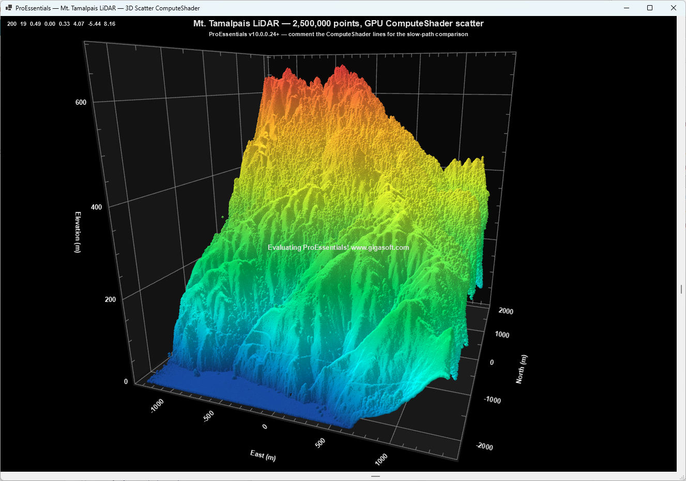

# Mt. Tamalpais LiDAR — 3D Point Cloud (ComputeShader) — WinForms

ProEssentials v10 **WinForms .NET 8** — a `Pe3do` 3D scatter chart rendering
~2.5M airborne LiDAR returns of Mt. Tamalpais, every point individually colored
by elevation, GPU-constructed via ComputeShader. Direct3D.

## What This Demonstrates
- **GPU ComputeShader scatter** (`PolyMode.Scatter`, v10.0.0.24+): per-point
  vertex construction across thousands of shader cores.
- **Per-point `PointColors`** packed as `peColor32` int layout (0xAABBGGRR),
  bulk-loaded with `FastCopyFrom(int[])`.
- **Binary data load** — `mttam_lidar.bin` (int32 count + float32 X/Y/Z blocks)
  read with `BinaryReader` + `Buffer.BlockCopy`.
- **Code-built UI** — single chart in `MainForm.cs`; no `.Designer.cs` / `.resx`.

## WinForms vs WPF
The binary loader, the elevation colormap, and the entire Pe3do configuration are
identical to the WPF version. Only host pieces changed: WinForms `MessageBox`,
`Application.Exit()`, `System.Drawing.Color`, and `Pe3doWpf` → `Pe3do`.

➡️ WPF version: [wpf-3d-lidar-point-cloud-computeshader-proessentials](https://github.com/GigasoftInc/wpf-3d-lidar-point-cloud-computeshader-proessentials)

## Data File
`mttam_lidar.bin` (~29 MB) is **not** included. Build it with
`python data/prepare_data.py path/to/*.laz` (see `data/README.md`), then rebuild
so it copies next to the executable. The app shows an error dialog and exits if
the file is missing at runtime.

## How to Run
1. Clone; build the `.bin` per `data/README.md`
2. Open `MtTamalpaisLidar3D.sln` in Visual Studio 2022
3. Build → Rebuild Solution; press F5. Left-drag to rotate; wheel to zoom.

## NuGet
References `ProEssentials.Chart.Net80.x64.Winforms` (>= 10.0.0.28).

## License
Example code is MIT licensed. ProEssentials requires a commercial license. LiDAR
data: OpenTopography / NCALM 2006 Marin collection.
